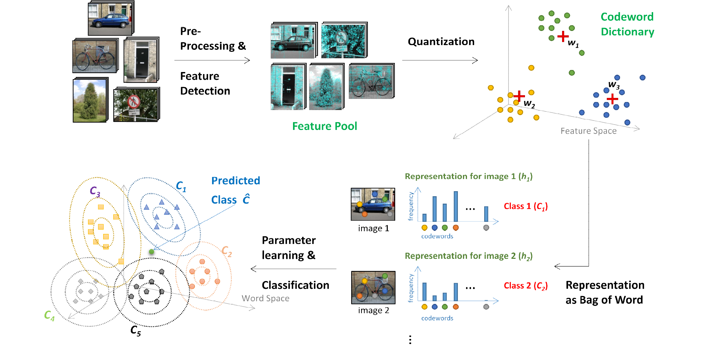

# Object Recognition System

The task in this project was to implement a **supervised object recognition**. In this recognition system, 
- *SIFT descriptor* was used to describe image feature
- *k-means clustering* to generate codeword dictionary
- *closet word allocation* to transform image to codeword histogram,
- *MLE, Maximum-likelihood estimation* to learn categorical distributions, 
- *Naive Bayesian classifier* to predict the classes of testing images.

The purpose of this task aimed to learning a **classification model** which can identify the true classes of unclassified objects in images. The dataset employed is **Microsoft Research Cambridge Object Recognition Image Database** which contains *9 object classes* and *240 images for each class*. 

I chose 5 classes and 100 images from each to class, and separate these images into two set: a training set and a testing set. The classes of these images are bicycle, car, door, sign and tree. 

In this project, there are two main M-files to execute supervised object recognition. 

- `CreateBoW.m`: In this file, the path of training image set can be inputted then the bog of word will be saved as mat file.

- `Classification.m`: In this file, the path of testing iamge set can be inputted, then the predicted classes of these testing images will be infered.

